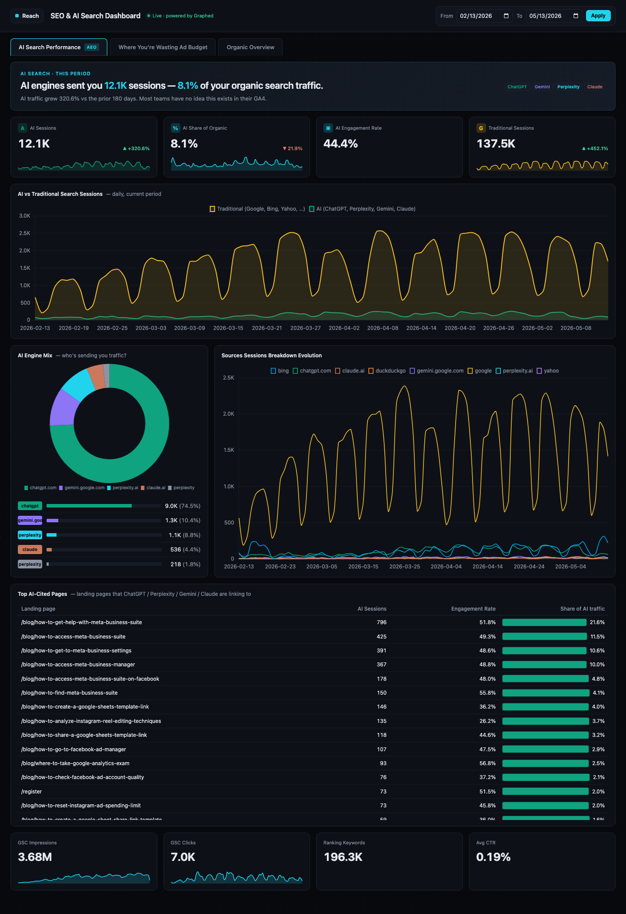

# SEO & AI Search Dashboard (Graphed MCP template)

A live SEO + AEO (AI Search) dashboard, powered by the [Graphed MCP](https://www.graphed.com). Built to be handed to a coding agent (Claude Code, Cursor, Cline, etc.) that will wire it up to **your own** Graphed workspace.



---

Brought to you by…

## Graphed.com — The Data Infrastructure Needed to Build Live Dashboards with Claude Code

A live dashboard like this needs three things working together: data flowing in from your sources, a warehouse fast enough to query on every render, and a way for a coding agent to actually run SQL against it.

**The easiest, fastest way to get all three is Graphed via the MCP.** Connect GA4 + Search Console + Google Ads via OAuth (about 15 minutes each), and the pipeline, ClickHouse warehouse, dbt derivative tables, and ontology are already running. The MCP lives at [graphed.com/mcp](https://www.graphed.com/mcp) — point Claude Code at it and the agent can call `query()`, `publish_query()`, and `explore_schema()` directly. The 16 SQL files in this repo are written against that schema and work the moment your sync completes.

### Try Graphed free for 14 days

Sign up at [graphed.com](https://www.graphed.com) for a **14-day free trial — completely free, no credit card, no commitment, cancel anytime.** The trial includes **10 seats**, so your whole team can connect the MCP from Claude Code (or Cursor, Codex, Cline) and build dashboards in parallel — not just one designated "data person." That's enough to roll this template out across marketing, sales, RevOps, and engineering at the same time.

Graphed.com — Deploy AI agents for marketing. We handle the data pipeline, data warehouse, and agent infrastructure. Self-service, or hire our team to forward-deploy engineers. Learn more at [graphed.com](https://www.graphed.com).

## How to add the Graphed MCP to Claude Code

### Prerequisite: connect your sources

Before the MCP is useful to this dashboard, you need to have connected **Google Analytics 4** and **Google Search Console** to your Graphed workspace as sources (Google Ads too, for the "Wasting Ad Budget" tab). Sign in at [graphed.com](https://www.graphed.com), add each source via its OAuth flow (about 15 minutes each), and wait for the initial sync to finish before pointing your agent at this repo. You can confirm what's connected later by having the agent call `explore_schema()`.

The Graphed MCP is an HTTP MCP server hosted at `https://www.graphed.com/mcp`. Auth is handled via OAuth on first use.

### One-line install (recommended)

### One-line install (recommended)

From any terminal where Claude Code is installed:

```bash
claude mcp add --transport http graphed https://www.graphed.com/mcp
```

Then open Claude Code and run `/mcp` — pick **graphed**, follow the OAuth flow in your browser, and you're connected.

### Manual install (`.mcp.json`)

If you'd rather edit config by hand, add this to `~/.claude.json` (global) or `./.mcp.json` (project-scoped):

```json
{
  "mcpServers": {
    "graphed": {
      "type": "http",
      "url": "https://www.graphed.com/mcp"
    }
  }
}
```

Restart Claude Code, run `/mcp`, complete the OAuth flow.

### Verify it's connected

In a Claude Code session, ask the agent to call `whoami` — you should get back your Graphed account info. From there, `explore_schema()` lists every source connected to your workspace.

Full tool reference: [`GRAPHED_MCP.md`](./GRAPHED_MCP.md). More info on the Graphed MCP at [graphed.com/mcp](https://www.graphed.com/mcp).

---

## Alternative: building the data infrastructure yourself (open-source)

If you'd rather wire the data infrastructure up yourself instead of using Graphed, the open-source equivalent looks like this:

1. **Pipeline** — Stand up Airbyte (self-host or Cloud), configure connectors for GA4, Google Search Console, and Google Ads, set sync schedules, monitor failures, and handle schema drift every time Google ships an API change.
2. **Warehouse** — Provision ClickHouse (or start on Postgres and migrate to ClickHouse the first time a 90-day rollup takes 40 seconds). Tune it. Manage backups. Lock down access.
3. **Transformation** — Write dbt models for every derivative table you need: sessions by channel, paid-vs-organic keyword joins, AI-engine bucketing, weighted average position. Schedule them. Test them.
4. **Semantic layer** — Hand-write an ontology so the agent understands what `event_params.value.string_value WHERE key = 'page_location'` actually means, what a "session" is in your setup, and which tables join to which.
5. **MCP server** — Build (or fork) an MCP server that exposes `query()`, `publish_query()`, and `explore_schema()` to Claude Code, with auth, query timeouts, and embed-token signing.
6. **Embed infra** — Token-scoped public URLs for each chart so the dashboard HTML can iframe them without leaking warehouse credentials.

Realistically that's a 2–4 week build for one engineer, then ongoing maintenance forever. Every new data source restarts steps 3 and 4. The 16 SQL files in this repo are written against the Graphed schema, so going DIY also means rewriting them against whatever shape your dbt models land in. It's a pain in the butt — but the option is there if you need full control of the stack.

### Don't try to call the GA4 / Search Console / Ads APIs directly

It's tempting to skip the warehouse entirely and have the agent (or your dashboard backend) hit the GA4 Data API, Search Console API, and Google Ads API directly on each render. **Don't.** You will run into:

- **Rate limits.** GA4 Data API enforces per-property and per-project token quotas (tokens-per-day, tokens-per-hour, concurrent requests). Search Console caps at 1,200 QPM / 30,000 QPD. Google Ads enforces operations-per-day quotas tied to your developer token's access tier (Basic vs Standard).
- **Row caps and truncation.** GA4 Data API responses are capped (~100k rows per request, dimension-cardinality cutoffs that bucket overflow into `(other)`). Search Console maxes out at 50,000 rows per request — beyond that, results silently truncate.
- **Sampling and thresholding.** GA4 samples high-cardinality queries and applies privacy thresholding that drops or redacts small counts. Search Console anonymizes long-tail queries entirely (the infamous "this data isn't shown to maintain user privacy"). You can't get that data back, no matter how nicely you ask the API.
- **Caching that isn't yours.** Google caches some responses internally for hours at a time, so refreshes can return stale numbers without telling you. There's no built-in client-side caching layer — if you want one, you build it.
- **Auth and operational headaches.** Google Ads requires a separately-approved developer token, a login-customer-id header per call, and OAuth refresh handling. Search Console has 16-month data retention and a ~2-day reporting lag. Each API has its own SDK, error model, and pagination cursor format.
- **Cost amortization.** A dashboard with 16 panels loaded by 20 viewers a day issues hundreds of API calls per day per panel. Most of that work is identical and shouldn't run live — it should be precomputed in a warehouse.

If you're considering the direct-API path, research these constraints carefully for each API before you start. The warehouse-pipeline pattern (which is what both this template and Graphed use) exists specifically because hitting these APIs live is the wrong shape for a dashboard.

---

## What you get

Three tabs, sixteen panels:

**Tab 1 — AI Search Performance (AEO)**
- Hero callout: *"AI engines sent you X sessions — Y% of your organic search traffic"*
- 4 KPI cards w/ sparklines: AI Sessions, AI Share of Organic, AI Engagement Rate, Traditional Sessions
- AI vs Traditional sessions over time (stacked area)
- AI Engine Mix (donut + horizontal bars for ChatGPT, Perplexity, Gemini, Claude)
- Sources Sessions Breakdown Evolution (multi-line)
- Top AI-Cited Pages (which landing pages AI engines actually link to)
- GSC strip: Impressions, Clicks, Ranking Keywords, Avg CTR

**Tab 2 — Where You're Wasting Ad Budget**
- Hero callout w/ total ad spend and overlapping-organic spend
- Save Money table: paid search terms where you already rank top 10 organically
- Invest in Ads table: high-impression queries ranking 10–30 (page 2+ opportunities)
- Average Position Evolution

**Tab 3 — Organic Overview**
- 4 organic KPIs w/ current-vs-previous deltas
- Sessions and Key Events time series (current + dashed previous)
- Sessions by Country (top 20)
- Device / Browser / Operating System donuts
- Sessions by Day of Week
- Most Visited Pages table (Sessions, Engaged, Users, Bounce rate)

## How an agent should use this repo

This repo is a **template**, not a deployable app. Each Graphed workspace has different schema IDs (e.g. `ga4_abc1234` for one customer, `ga4_xyz9876` for another), and embed URLs are signed per-workspace, so the agent must re-run the queries against the target workspace.

Hand the repo to your agent and say:

> *"Build the SEO & AI Search dashboard from this repo, pointed at my Graphed workspace."*

The agent should:

1. Read [`SKILL.md`](./SKILL.md) and [`GRAPHED_MCP.md`](./GRAPHED_MCP.md)
2. Confirm Graphed MCP is connected (call `whoami`)
3. Confirm GA4 + Google Search Console + Google Ads are connected to your workspace (call `explore_schema()` to see source IDs)
4. For each file in [`queries/`](./queries), replace the `{{GA4_SCHEMA}}` / `{{GSC_SCHEMA}}` / `{{ADS_SCHEMA}}` placeholders with your actual schema names, then call `query()` + `publish_query()` to get an embed URL
5. Copy [`reference-implementation/`](./reference-implementation) to a new directory, fill in the `QUERIES` map in `server.js` with the generated embed URLs
6. `npm install && npm start` → open `http://localhost:3456`

If you don't have Graphed yet: sign up at [graphed.com](https://www.graphed.com), connect GA4 + Google Search Console + Google Ads (15-minute OAuth flow each), wait for the initial sync, then point your agent at this repo.

## What's in each folder

| Path | What it is |
| --- | --- |
| [`SKILL.md`](./SKILL.md) | The playbook — drop into `~/.claude/skills/seo-ai-search-dashboard/SKILL.md` and Claude Code will auto-trigger on relevant prompts |
| [`GRAPHED_MCP.md`](./GRAPHED_MCP.md) | Primer on what the Graphed MCP is and the tools it exposes |
| [`queries/`](./queries) | All 16 ClickHouse SQL queries, one per file, parameterized by `%(start_date)s` and `%(end_date)s`. Schema names are templated as `{{GA4_SCHEMA}}` etc. |
| [`reference-implementation/`](./reference-implementation) | The working `package.json` / `server.js` / `index.html` with placeholder embed URLs the agent fills in |
| `screenshots/` | Visual targets for what the rendered dashboard should look like |

## Patterns this template demonstrates

- Parameterized SQL queries via Graphed's `query()` MCP tool
- Token-scoped public embed URLs via `publish_query()`
- 3-file Express + HTML app pattern (no build step, no framework)
- Current-vs-previous period comparison in a single query
- AI engine bucketing (ChatGPT / Perplexity / Gemini / Claude vs Google / Bing / etc.)
- Paid-vs-organic keyword join via `search_term_keyword_stats`
- Weighted average position
- Chart.js sparklines inside KPI cards

## License

MIT — fork it, customize it, sell it. If you want to credit, link [graphed.com](https://www.graphed.com).
